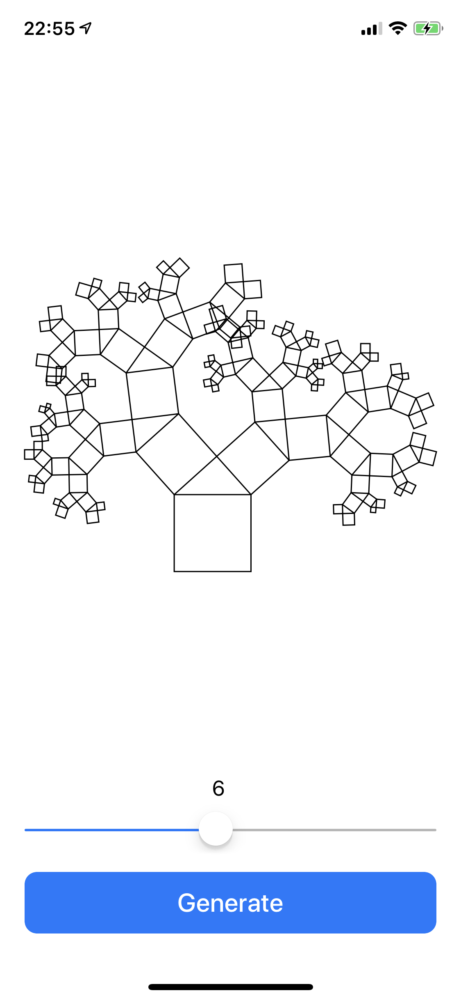
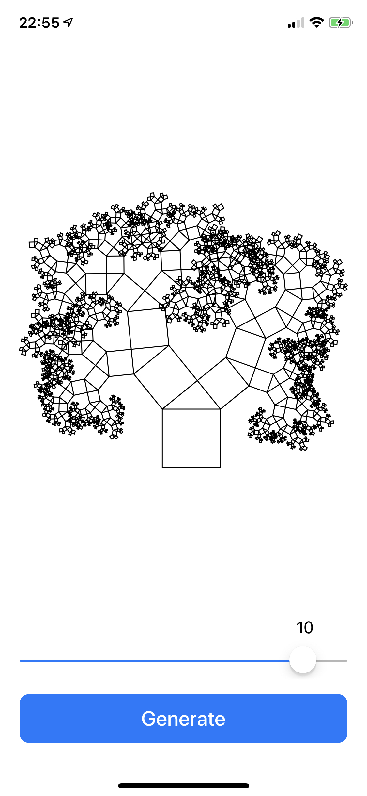
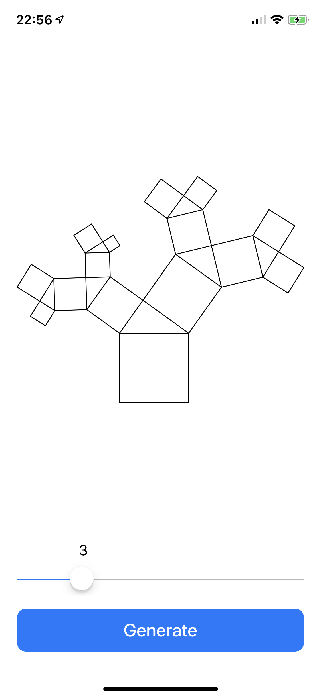

# PythagorasTrees
An demo app which renders Pythagoras Trees up to a desired branch depth (ported from Java).
Every triangle is randomly generated with an alpha-angle between 30 and 60 degrees.
Will add some customisation soon

Branch level 6             |  Branch level 10          | Branch Level 3 |
:-------------------------:|:-------------------------:|:-------------:
  |   | |

